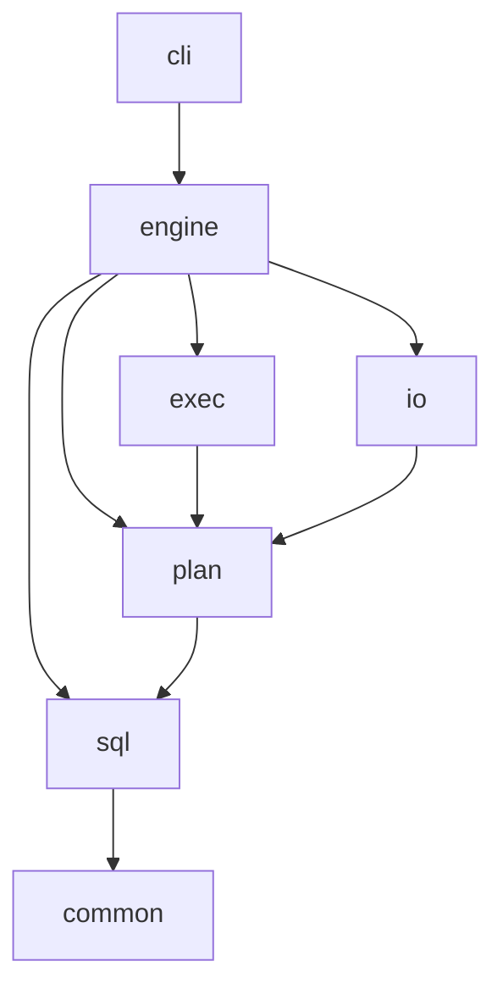

# Architecture

antb1 is a small, single-process SQL engine over Parquet files. It is split into seven C++23 static libraries
(modules) and one binary, `antb1`. This page describes the code as it is today; the engine design beyond the first
SQL slice is still open (see [ADR 0003](adr/0003-engine-architecture.md)).

## Modules

`cmake/Antb1Modules.cmake` is the single source of truth for which module may depend on which module and which
external libraries it may link. `antb1_add_module()` fails the configure step on any other edge, and
`antb1_check_module_graph()` catches edges added around it. The table below must match that file exactly
(`pixi run lint` compares them); changing an edge is an architecture decision that needs an ADR.

| Module | May depend on | External libraries |
| --- | --- | --- |
| `common` | none | none |
| `sql` | `common` | none |
| `plan` | `common`, `sql` | Arrow |
| `io` | `common`, `plan` | Arrow, Parquet |
| `exec` | `common`, `plan` | Arrow, ArrowCompute |
| `engine` | `common`, `sql`, `plan`, `io`, `exec` | Arrow, ArrowCompute |
| `cli` | `common`, `engine` | Arrow, CLI11 |

Responsibilities:

- `common`: invariant checks (`ANTB1_CHECK`, `ANTB1_DCHECK`), checked integer narrowing (`TryNarrow`, `Narrow`),
  `SourceSpan`, the `Int128` helpers, UTF-8 validation (`Utf8SequenceLength`, shared by the lexer, the JSON output and
  the test harness) and the version string. Arrow-free.
- `sql`: lexer, hand-written recursive-descent parser, AST with source spans, canonical unparser (`ToSql`) and
  `EqualIgnoringSpans`. Arrow-free; errors are `std::expected<T, sql::ParseError>`
  ([ADR 0008](adr/0008-parser-and-unparser.md)).
- `plan`: logical types and their Arrow mapping, the `plan::Table` interface, the case-insensitive `Catalog`, the
  binder with exact literal folding (`binder.h`, `literal.h`), the logical plan (`logical_plan.h`), the rule
  optimizer (`optimizer.h`), EXPLAIN, and the error boundary between `std::expected` and `arrow::Status` in
  `src/plan/include/antb1/plan/sql_status.h` ([ADR 0005](adr/0005-error-boundary.md)).
- `io`: `io::ParquetTable`, which implements `plan::Table` over one or more Parquet files with identical schemas,
  and glob expansion. Its `Scan` reads the requested top-level fields file by file (one `parquet::arrow::FileReader`
  at a time, single-threaded, mapping each field to its Parquet leaf columns, without pre-buffering, so it holds
  about one row group of the scanned columns rather than every chunk read so far) and converts the batches to the
  engine view: UTF8 and large strings to binary without UTF-8 validation, FLOAT to DOUBLE, a USMALLINT or INTEGER
  column read as DATE to date32. Every Parquet exception and read failure becomes an `IOError` here.
- `exec`: pull-based, batch-at-a-time physical operators (`TableScan`, `Filter`, `Project`, `ScalarAggregate`,
  `Limit`, `RowCount`; see [Execution](#execution)), the exact aggregate states, the physical planner and `Drain`. It
  scans only through `plan::Table` and never depends on `io`.
- `engine`: `engine::Session` (owns the catalog, calls `arrow::compute::Initialize()`, runs parse, bind, plan and
  execute) and the canonical value formatter used for every output format.
- `cli`: the CLI11 command line (`query`, `explain`, `schema`, `bench`, `version`), error reporting and exit codes;
  `bench` writes ClickBench's result JSON ([benchmarks.md](benchmarks.md)). The `antb1` executable is
  `src/cli/main.cc`.

`common` and `sql` never include Arrow, so the front end stays small, fast to build and easy to fuzz.

Every module except `common` may also depend on `common` directly; those edges are left out of the diagram.

## Query lifecycle

A query such as `antb1 query -c "SELECT COUNT(*) FROM t" --table "t=/data/part_*.parquet"` runs through these
steps (all single-threaded):

1. `cli` parses the command line, reads the SQL (`-c`, `-c -` for stdin, or `-f`) and creates an `engine::Session`,
   which calls `arrow::compute::Initialize()`.
2. `--table NAME=PATH[,PATH|GLOB]` registers an `io::ParquetTable`: globs expand to a sorted file list, every
   footer is read, schemas must match, and column overrides such as `--clickbench` (EventDate as DATE) apply. No
   data pages are read at this point.
3. Parse (`sql::Parse`): tokens, then a `SelectStatement` AST with spans. Syntax outside the supported subset is a
   `kUnsupported` error with the span of the offending token. The engine converts a parse error with
   `plan::ToArrowStatus` into an `arrow::Status` that carries a `SqlErrorDetail`.
4. Bind (`plan::Bind`): table names resolve case-insensitively in the catalog (or `FROM 'path'` opens a file),
   columns resolve against the table's schema, types are checked, and every `WHERE` literal is folded exactly into
   its column's type ([Binding](sql-subset.md#binding)). The result is a `plan::LogicalPlan`: a tree of immutable
   nodes in a `std::variant` (`Scan`, `Filter`, `Project`, `Aggregate`, `Limit`, `RowCount`) plus the output
   columns.
5. Optimize (`plan::Optimize`): projection pruning (a `Scan` reads only the fields used above it) and `COUNT(*)`
   without `WHERE` to `RowCount`.
6. Physical plan (`exec::BuildPhysicalPlan`): an exhaustive `std::visit` turns each logical node into an operator
   over the operator of its input.
7. Drain (`exec::Drain`): `Open`, pull batches with `Next` until the end of the stream, `Close` (also after an
   error); the selected rows of the batches form an `arrow::Table`, and the engine names its columns.
8. Format (`engine::FormatResult`): `table`, `csv` or `json` output on stdout, built from one canonical value
   formatter. With `--timing`, the elapsed seconds are the last line on stderr.

`antb1 explain` stops after step 5 and prints the optimized logical plan. Any error travels up as an
`arrow::Status`, and `cli` maps it to an exit code (see [the SQL subset](sql-subset.md#exit-codes)).

## Execution

Operators pull `exec::Batch`es from their input: an Arrow record batch and an optional selection, a boolean array
without NULLs that marks the rows taking part. A filter never copies data, and only a projection turns a selection
into data. Everything runs on one thread, reading files and row groups in order.

| Operator | Logical node | Does |
| --- | --- | --- |
| `TableScanOperator` | `Scan` | `plan::Table::Scan` of the referenced fields only, in batches of `ExecContext::batch_size` rows (64Ki) |
| `FilterOperator` | `Filter` | evaluates every comparison with Arrow's comparison kernels (`equal`, `less`, ...), combines them with `and_kleene`, turns NULL into false and attaches the result as the selection; skips batches without a selected row; a folded `FALSE` ends the stream without reading |
| `ProjectOperator` | `Project` | selects columns and materializes the selected rows with Arrow's `Filter` kernel |
| `ScalarAggregateOperator` | `Aggregate` | feeds every batch and its selection to one `AggregateState` per call, then emits one row |
| `LimitOperator` | `Limit` | passes on the first `n` rows and never pulls its input again |
| `RowCountOperator` | `RowCount` | one BIGINT row from the table's exact row count |

The aggregate states (`src/exec/include/antb1/exec/aggregate_state.h`) implement `Consume(values, selection)`,
`Merge` and `Finalize`. `COUNT(*)` is the true count of the selection; `COUNT(col)`, `SUM` and `AVG` walk the runs
of rows that are both selected and non-NULL (one bitmap AND); integer `SUM` and `AVG` accumulate in `antb1::Int128`
and `SUM` returns decimal128(38, 0), so nothing wraps at 64 bits; `MIN` and `MAX` run Arrow's `min_max` on the
filtered values of each batch and keep the best. Semantics: [sql-subset.md](sql-subset.md#semantics).

## Where to add things

| To add | Change | Also update |
| --- | --- | --- |
| SQL syntax | `src/sql/` (lexer, parser, AST, unparser) with tests in `src/sql/tests/` | [sql-subset.md](sql-subset.md) grammar |
| Name resolution or type rules | `src/plan/binder.cc`, `src/plan/types.cc` | [sql-subset.md](sql-subset.md), [ADR 0004](adr/0004-types-null-overflow-semantics.md) if semantics change |
| A logical plan node | the variant in `src/plan/include/antb1/plan/logical_plan.h`; the compiler then points at every `std::visit` to extend (physical planner, optimizer, EXPLAIN) | tests in `src/plan/tests/` and `src/exec/tests/` |
| An optimizer rule | `src/plan/optimizer.cc` | tests in `src/plan/tests/optimizer_test.cc`, an EXPLAIN golden in `tests/cli/` |
| A physical operator | `src/exec/` | tests in `src/exec/tests/` |
| A SQL feature antb1 now answers | the modules above | `.slt` records in `tests/slt/cases/` (`pixi run slt-complete`), the feature in `tests/slt/supported_features.h`, [sql-subset.md](sql-subset.md); when `pixi run test-data` reports a new ClickBench pass, the ratchet `tests/data/clickbench_status.json` and the status table |
| A table source or file format | a new `plan::Table` implementation in `src/io/` | an ADR if it needs a new dependency |
| A CLI flag or subcommand | `src/cli/cli.cc` | tests in `src/cli/tests/`, CLI goldens in `tests/cli/`, [sql-subset.md](sql-subset.md) |
| An output format | `src/engine/format.cc` | tests in `src/engine/tests/` |
| A micro benchmark | `bench/micro_bench.cc` | [benchmarks.md](benchmarks.md) |
| A module edge or external library | `cmake/Antb1Modules.cmake` (ask a maintainer first) | this page and a new ADR |
| A cross-module test suite | `tests/CMakeLists.txt` | [testing.md](testing.md) |
| A pixi task | `pixi.toml`, in exactly one environment (ask a maintainer first) | the command table in [AGENTS.md](../AGENTS.md) or [ci.md](ci.md) |
