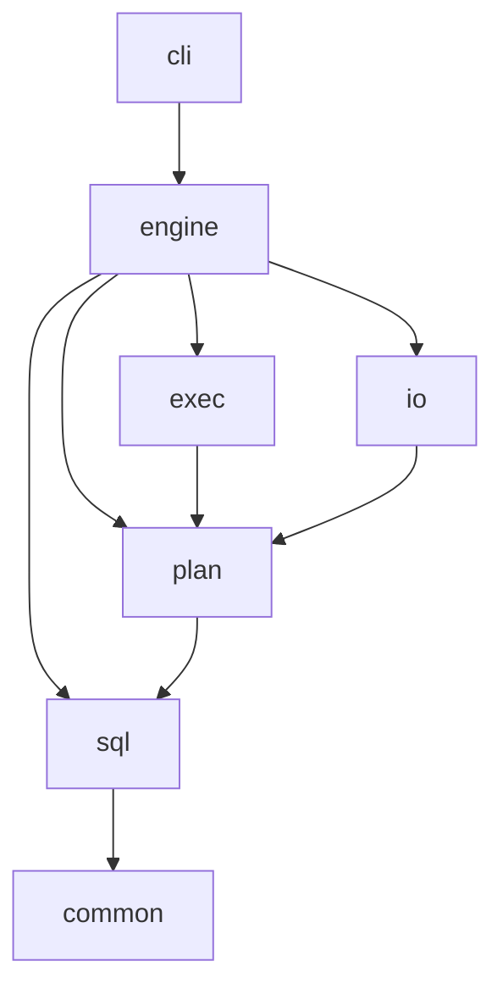

# Architecture

antb1 is a small, single-process SQL engine over Parquet files. It is split into seven C++23 static libraries
(modules) and one binary, `antb1`. This page describes the code as it is today; the engine design beyond the first
SQL slice is still open (see [ADR 0003](adr/0003-engine-architecture.md)).

## Modules

`cmake/Antb1Modules.cmake` is the single source of truth for which module may depend on which module and which
external libraries it may link. `antb1_add_module()` fails the configure step on any other edge, and
`antb1_check_module_graph()` catches edges added around it. The table below must match that file exactly
(`pixi run lint` compares them); changing an edge is an architecture decision that needs an ADR.

| Module | May depend on | External libraries |
| --- | --- | --- |
| `common` | none | none |
| `sql` | `common` | none |
| `plan` | `common`, `sql` | Arrow |
| `io` | `common`, `plan` | Arrow, Parquet |
| `exec` | `common`, `plan` | Arrow, ArrowCompute |
| `engine` | `common`, `sql`, `plan`, `io`, `exec` | Arrow, ArrowCompute |
| `cli` | `common`, `engine` | Arrow, CLI11 |

Responsibilities:

- `common`: invariant checks (`ANTB1_CHECK`, `ANTB1_DCHECK`), checked integer narrowing (`TryNarrow`, `Narrow`),
  `SourceSpan`, the `Int128` helpers, UTF-8 validation (`Utf8SequenceLength`, shared by the lexer, the JSON output and
  the test harness) and the version string. Arrow-free.
- `sql`: lexer, hand-written recursive-descent parser, AST with source spans, canonical unparser (`ToSql`) and
  `EqualIgnoringSpans`. Arrow-free; errors are `std::expected<T, sql::ParseError>`
  ([ADR 0008](adr/0008-parser-and-unparser.md)).
- `plan`: logical types and their Arrow mapping, the `plan::Table` interface, the case-insensitive `Catalog`, the
  binder with exact literal folding (`binder.h`, `literal.h`), the logical plan (`logical_plan.h`), the rule
  optimizer (`optimizer.h`), EXPLAIN, and the error boundary between `std::expected` and `arrow::Status` in
  `src/plan/include/antb1/plan/sql_status.h` ([ADR 0005](adr/0005-error-boundary.md)).
- `io`: `io::ParquetTable`, which implements `plan::Table` over one or more Parquet files with identical schemas,
  and glob expansion. Its `Scan` reads the requested top-level fields file by file (one `parquet::arrow::FileReader`
  at a time, single-threaded, mapping each field to its Parquet leaf columns, without pre-buffering, so it holds
  about one row group of the scanned columns rather than every chunk read so far) and converts the batches to the
  engine view: UTF8 and large strings to binary without UTF-8 validation, FLOAT to DOUBLE, a USMALLINT or INTEGER
  column read as DATE to date32. Every Parquet exception and read failure becomes an `IOError` here. The footers
  read at `Open` are kept and reused by every scan; a file whose size or footer bytes changed since is an
  `IOError`. The table's parts (`plan::Table::num_parts`, `part_rows`, `ScanPart`), the units of parallel work of
  [ADR 0013](adr/0013-parallel-execution.md), are its row groups with rows in file order; scanning them one after
  another gives the rows of `Scan`. Other tables are one part by default.
- `exec`: pull-based, batch-at-a-time physical operators (`TableScan`, `Filter`, `Compute`, `Project`, `ScalarAggregate`,
  `GroupAggregate`, `Sort`, `Limit`, `RowCount`; see [Execution](#execution)), the exact aggregate states (scalar
  and grouped), the row comparator and sort buffer, the physical planner and `Drain`. It scans only through
  `plan::Table` and never depends on `io`.
- `engine`: `engine::Session` (owns the catalog, calls `arrow::compute::Initialize()`, runs parse, bind, plan and
  execute) and the canonical value formatter used for every output format.
- `cli`: the CLI11 command line (`query`, `explain`, `schema`, `bench`, `version`), error reporting and exit codes;
  `bench` writes ClickBench's result JSON ([benchmarks.md](benchmarks.md)). The `antb1` executable is
  `src/cli/main.cc`.

`common` and `sql` never include Arrow, so the front end stays small, fast to build and easy to fuzz.

```mermaid
graph TD
  cli --> engine
  engine --> exec
  engine --> io
  engine --> plan
  engine --> sql
  exec --> plan
  io --> plan
  plan --> sql
  sql --> common
```

Every module except `common` may also depend on `common` directly; those edges are left out of the diagram.

## Query lifecycle

A query such as `antb1 query -c "SELECT COUNT(*) FROM t" --table "t=/data/part_*.parquet"` runs through these
steps (only step 7 uses more than one thread):

1. `cli` parses the command line, reads the SQL (`-c`, `-c -` for stdin, or `-f`) and creates an `engine::Session`,
   which calls `arrow::compute::Initialize()`.
2. `--table NAME=PATH[,PATH|GLOB]` registers an `io::ParquetTable`: globs expand to a sorted file list, every
   footer is read, schemas must match, and column overrides such as `--clickbench` (EventDate as DATE) apply. No
   data pages are read at this point.
3. Parse (`sql::Parse`): tokens, then a `SelectStatement` AST with spans; expressions are trees (`sql::Expr`), parsed
   by precedence climbing with a depth limit. Syntax outside the grammar is a `kUnsupported` error with the span of
   the offending token. The engine converts a parse error with
   `plan::ToArrowStatus` into an `arrow::Status` that carries a `SqlErrorDetail`.
4. Bind (`plan::Bind`): table names resolve case-insensitively in the catalog (or `FROM 'path'` opens a file),
   columns resolve against the table's schema, types are checked, and every `WHERE` literal is folded exactly into
   its column's type ([Binding](sql-subset.md#binding)); `HAVING` binds the same way against the aggregation's output
   and becomes a `Filter` above it. The result is a `plan::LogicalPlan`: a tree of immutable
   nodes in a `std::variant` (`Scan`, `Filter`, `Compute`, `Project`, `Aggregate`, `GroupAggregate`, `Sort`, `Limit`,
   `RowCount`) plus the output columns.
5. Optimize (`plan::Optimize`): `COUNT(*)` without `WHERE` to `RowCount`, `Limit` below `Project`, and projection
   pruning (a `Scan` reads only the fields used above it).
6. Physical plan (`exec::BuildPhysicalPlan`): an exhaustive `std::visit` turns each logical node into an operator
   over the operator of its input; a `Limit` over a `Sort` becomes one top-N `SortOperator`. A global aggregation
   whose calls are all `COUNT(DISTINCT x)` of one column over a part pipeline becomes a `GroupAggregate` by `x`
   (merged in parallel, partitioned) with `COUNT(x)` over its groups. Other aggregations with `COUNT(DISTINCT)`
   over a part pipeline run in two levels when their calls allow it (`exec::TwoLevelAggregation`,
   [ADR 0014](adr/0014-two-level-aggregation.md)). The chain of `Filter`,
   `Compute` and `Project` nodes over a `Scan` is a part pipeline, built once per table part (see
   [Execution](#execution)).
7. Drain (`exec::Drain`): `Open`, pull batches with `Next` until the end of the stream, `Close` (also after an
   error); the selected rows of the batches form an `arrow::Table`, and the engine names its columns. The part
   pipelines run on the session's thread pool (`--threads`, `engine::SessionOptions::threads`).
8. Format (`engine::FormatResult`): `table`, `csv` or `json` output on stdout, built from one canonical value
   formatter. With `--timing`, the elapsed seconds are the last line on stderr.

`antb1 explain` stops after step 5 and prints the optimized logical plan. `antb1 explain --analyze` builds the physical
plan with a profile root (`exec::ProfileNode`; each operator wrapped in `exec::ProfiledOperator`, a part pipeline
profiled once per part into the same nodes), runs it, drops the rows and prints the profile
(`engine::FormatProfile`, [ADR 0015](adr/0015-query-profiles.md)). Any error travels up as an
`arrow::Status`, and `cli` maps it to an exit code (see [the SQL subset](sql-subset.md#exit-codes)).

## Execution

Operators pull `exec::Batch`es from their input: an Arrow record batch and an optional selection, a boolean array
without NULLs that marks the rows taking part. A filter never copies data, and only a projection turns a selection
into data. Every operator instance is used by one thread.

**Parts** ([ADR 0013](adr/0013-parallel-execution.md)). A table is split into parts (`plan::Table::num_parts`,
`ScanPart`): the row groups of a Parquet table. The pipeline below the first blocking operator, a chain of `Filter`,
`Compute` and `Project` over a `Scan`, is built once per part with a `TableScanOperator` of that part, so parts share
no operator state. `exec::PartScheduler` runs the parts on `ExecContext::executor` (an Arrow `ThreadPool` the
`Session` owns when it has more than one thread) and hands their results back strictly in part order. At most
2 × threads parts are running or finished but not yet taken. With one thread, each part runs on the calling thread
when it is reached: the same code, so a result does not depend on the thread count. The first failing part in part
order decides the error. Parts after the point where the consumer stops (a met `LIMIT`) are never started or are
stopped at their next batch, and their errors are dropped.

**Skipping parts.** The physical planner reads only the parts a pipeline's WHERE can match: for each part it asks
`plan::Table::part_stats` (for Parquet, the row group's column chunk statistics from the footer: exact min, max and
NULL count of integer-valued columns, including a DATE read from day numbers, but not HUGEINT, whose decimal
statistics some writers got wrong) and drops the part when a predicate of
a `Filter` directly on the scan is false for every row there (`exec::KeptParts`, `src/exec/part_pruning.h`):
`= < <= > >=` against the min/max, `<>` when every value is the constant, `IN` with every value outside, any
comparison, `IN` or `IS NOT NULL` on an all-NULL column, and a folded `FALSE`. Unknown statistics (DOUBLE, whose
min/max may leave NaN out; VARCHAR, whose min/max may be truncated; TIMESTAMP; a file without statistics) never
skip, so a skipped part never holds a matching row and results do not change.

**Memory.** The `Session` owns an `exec::MemoryBudget` (`--memory-limit`, `engine::SessionOptions::memory_limit`):
an Arrow memory pool that is `ExecContext::pool` for every query, and that the Parquet reader decodes into
(`plan::Table::Scan` and `ScanPart` take the pool). It counts every buffer and, through `Reserve`, the containers
operators keep outside Arrow buffers: the grouped aggregate states (`GroupedAggregateState::memory_usage`) and the
sort buffer's row references (`SortBuffer::memory_usage`, plus `sort_memory` while it sorts), each held in an
`exec::MemoryReservation` that gives the bytes back on `Close`. The count is atomic and checked before an
allocation, so threads never pass the limit together; past it, an allocation fails with `Status::OutOfMemory` and
nothing is left behind. A result keeps the budget alive (`QueryResult::memory`) as long as its buffers exist. The
part scheduler's window adapts to the budget: every part taken above half of the limit halves it, every part taken
below widens it by one, and above half no new part starts while another is in flight. A part that runs out of memory
next to others does not fail the query: the parts ahead are dropped (and run again when reached) and it runs again
alone. The partition lanes of a GROUP BY hold at most as many parts as the window (one above half of the limit)
before the consumer waits for them to merge, and they finish merging before a part runs again alone. A
`std::bad_alloc` from a container (outside the budget's view) is caught in the part tasks and in `Drain` and becomes
`OutOfMemory` too.

The budget's pool is Arrow's default pool, mimalloc. On Linux the `antb1` executable restarts itself once with
`MIMALLOC_PURGE_DELAY=-1` (`cli::RestartForAllocator`, ADR 0017), so that mimalloc keeps the memory a query frees
instead of returning it to the system and faulting it back in: unless the variable is set (a value the user set
wins) or `ARROW_DEFAULT_MEMORY_POOL` names another pool. The process then keeps its peak resident memory until it
exits; the budget, which counts allocations, is unchanged.

| Operator | Logical node | Does |
| --- | --- | --- |
| `TableScanOperator` | `Scan` | `plan::Table::ScanPart` (in a part pipeline) or `Scan` of the referenced fields only, in batches of `ExecContext::batch_size` rows (64Ki) |
| `PartUnionOperator` | the top of a part pipeline | the batches of every part in part order, parts computed ahead on the pool; under a `Limit`, each part stops after `limit + offset` selected rows |
| `PartAggregateOperator` | `Aggregate` over a part pipeline | aggregates every part into its own `AggregateState`s on the pool, then merges them in part order and emits one row |
| `PartGroupAggregateOperator` | `GroupAggregate` over a part pipeline | groups every part into its own `exec::GroupTable` on the pool and splits its groups into 64 partitions by a hash of their normalized keys (`GroupTable::Partition`, on the worker); merges the parts in part order into one table per partition (a part whose first 4096 rows make more groups than 3/4 of them stops aggregating on its own: its other rows are split by the same key hash, `GroupTable::RouteRows`, and the partitions aggregate them after the part's groups), each partition in its own lane on the pool (`exec::PartitionLanes`: a lane merges the parts in the order they come and never waits for another lane; the partition's unique keys through the partition table's grouper give the groups they become; `GroupedAggregateState::MergeGroups(part_state, from, to)` folds just the partition's groups, in time proportional to them; a new group keeps the part's first-seen keys); then builds the partitions' rows in parallel, as many partitions at a time as threads (one under memory pressure), and emits them partition after partition as `GroupAggregate` does |
| `PartTwoLevelAggregateOperator` | `GroupAggregate` or `Aggregate` with `COUNT(DISTINCT)` over a part pipeline, when `TwoLevelAggregation` allows it | groups every part into one inner `GroupTable` per distinct column (keys K and the column) and a plain one by K for the other calls; the first parts (4M rows by metadata) decide the heavy K (`HeavyHitters`); partitions a light K by the hash of K and a heavy K's groups by the hash of K and the column (`GroupTable::Partition(prefix, heavy)`); merges as `PartGroupAggregateOperator`; then, per partition in parallel, groups the inner groups by K (`OuterGroups`: a distinct column's count is its inner groups with a non-NULL value) and builds the light groups' rows; merges the heavy K's groups across partitions in partition order and emits them last ([ADR 0014](adr/0014-two-level-aggregation.md)) |
| `PartTopNOperator` | `Limit` over `Sort` (a top-N) over a part pipeline | keeps every part's first `limit + offset` rows of the order in its own `SortBuffer` on the pool, merges the buffers in part order (ties keep their input order, parts in part order) and keeps the first `limit + offset` again: exactly the serial top-N's rows and order; emits the window; with late materialization ([ADR 0016](adr/0016-late-materialization.md): limit + offset at most half of the kept parts) the parts scan only the columns their filters, computations and keys read (`exec::LateScan`: the others are NULL placeholders, one of them carries the rows' ids), and the window's other columns are read from their parts afterwards, one task per part and column |
| `FilterOperator` | `Filter` | evaluates every comparison with Arrow's comparison kernels (`equal`, `less`, ...) and `[NOT] LIKE` with `exec::LikePattern` (DuckDB's rules; patterns without `_` match by their literal segments), `[NOT] IN` as `equal` per value combined with `or_kleene` (and `invert` for NOT IN), compares two columns with the same kernels in their common type, combines them with `and_kleene`, keeps the rows of a computed BOOLEAN condition (`IS TRUE`, for `OR` and `NOT`), turns NULL into false and attaches the result as the selection (one `exec::PredicateEvaluator` per predicate, shared with `Compute`); skips batches without a selected row; a folded `FALSE` ends the stream without reading |
| `ComputeOperator` | `Compute` | materializes the selected rows and appends one array per expression (`exec::EvaluateExpr`): Arrow's checked kernels for integer `+ - *` and negation in the result type (an overflow is an execution error), `divide` in DOUBLE, own loops for `//`, `%` and HUGEINT arithmetic, `binary_length` for `strlen`, `replace_substring_regex` (RE2) for `regexp_replace`, a checked loop for `epoch_ms` (`toDateTime`), own 64-bit civil-calendar loops for `EXTRACT` and `date_trunc` (DuckDB's whole TIMESTAMP range; infinities kept or NULL), the filter's predicate evaluation for comparisons inside conditions, `and_kleene`/`or_kleene`/`invert` for `AND`/`OR`/`NOT`, and `CASE` branch by branch, each condition and value computed only for its rows (`Filter`, then `replace_with_mask`) ([ADR 0012](adr/0012-scalar-expressions.md)) |
| `ProjectOperator` | `Project` | selects columns and materializes the selected rows with Arrow's `Filter` kernel; a constant item becomes an array of its value per batch (`MakeArrayFromScalar`) |
| `ScalarAggregateOperator` | `Aggregate` over other input | feeds every batch and its selection to one `AggregateState` per call, then emits one row |
| `GroupAggregateOperator` | `GroupAggregate` over other input | through an `exec::GroupTable`, materializes the selected rows, maps their keys to group ids with Arrow's `Grouper` (DOUBLE keys normalized first), feeds one `GroupedAggregateState` per call; after the input, emits one row per group: the keys as first seen, then the aggregates; without keys (`GROUP BY` of constants only) every row is in one group |
| `SortOperator` | `Sort`, or `Limit` over `Sort` over other input | reads its whole input into a `SortBuffer`, sorts row references stably with `RowComparator` (DuckDB's order: NULLs last by default, NaN above every number, VARCHAR by bytes; each row carries an order-preserving 64-bit prefix of its first key, so most comparisons are integer compares) and emits the rows in batches, gathered column by column with typed builders; with a limit it keeps only `limit + offset` rows while it reads (top-N) and emits the window ([ADR 0011](adr/0011-sorting-and-top-n.md)) |
| `LimitOperator` | `Limit` | skips `offset` rows, passes on at most `limit` rows (narrowing selections, not copying) and then never pulls its input again |
| `RowCountOperator` | `RowCount` | one BIGINT row from the table's exact row count |

The aggregate states (`src/exec/include/antb1/exec/aggregate_state.h`) implement `Consume(values, selection)`,
`Merge` and `Finalize`. `COUNT(*)` is the true count of the selection; `COUNT(col)`, `SUM` and `AVG` walk the runs
of rows that are both selected and non-NULL (one bitmap AND); integer `SUM` and `AVG` accumulate in `antb1::Int128`
and `SUM` returns decimal128(38, 0), so nothing wraps at 64 bits; `MIN` and `MAX` run Arrow's `min_max` on the
filtered values of each batch and keep the best; `COUNT(DISTINCT col)` keeps the distinct values as the keys of an
Arrow `Grouper` (DOUBLE values normalized like `GROUP BY` keys) and counts them without NULL. The grouped states
(`src/exec/include/antb1/exec/grouped_aggregate_state.h`) keep the same accumulators per group, fed rows with a group
id each (`COUNT(DISTINCT col)`: a `Grouper` over the distinct (group, value) pairs); their `Merge` folds another
state's groups through a group map, so partial results of separate parts of the input can be combined
([ADR 0010](adr/0010-grouped-aggregation.md)). Semantics:
[sql-subset.md](sql-subset.md#semantics).

## Where to add things

| To add | Change | Also update |
| --- | --- | --- |
| SQL syntax | `src/sql/` (lexer, parser, AST, unparser) with tests in `src/sql/tests/` | [sql-subset.md](sql-subset.md) grammar |
| Name resolution or type rules | `src/plan/binder.cc`, `src/plan/types.cc` | [sql-subset.md](sql-subset.md), [ADR 0004](adr/0004-types-null-overflow-semantics.md) if semantics change |
| A logical plan node | the variant in `src/plan/include/antb1/plan/logical_plan.h`; the compiler then points at every `std::visit` to extend (physical planner, optimizer, EXPLAIN) | tests in `src/plan/tests/` and `src/exec/tests/` |
| An optimizer rule | `src/plan/optimizer.cc` | tests in `src/plan/tests/optimizer_test.cc`, an EXPLAIN golden in `tests/cli/` |
| A physical operator | `src/exec/`; its name in the physical planner (`Builder::Name`), and metrics for its phases through `profile()` and `ProfileTimer` | tests in `src/exec/tests/` |
| A SQL feature antb1 now answers | the modules above | `.slt` records in `tests/slt/cases/` (`pixi run slt-complete`), the feature in `tests/slt/supported_features.h`, [sql-subset.md](sql-subset.md); when `pixi run test-data` reports a new ClickBench pass, the ratchet `tests/data/clickbench_status.json` and the status table |
| A table source or file format | a new `plan::Table` implementation in `src/io/` | an ADR if it needs a new dependency |
| A CLI flag or subcommand | `src/cli/cli.cc` | tests in `src/cli/tests/`, CLI goldens in `tests/cli/`, [sql-subset.md](sql-subset.md) |
| An output format | `src/engine/format.cc` | tests in `src/engine/tests/` |
| A micro benchmark | `bench/micro_bench.cc` | [benchmarks.md](benchmarks.md) |
| A module edge or external library | `cmake/Antb1Modules.cmake` (ask a maintainer first) | this page and a new ADR |
| A cross-module test suite | `tests/CMakeLists.txt` | [testing.md](testing.md) |
| A pixi task | `pixi.toml`, in exactly one environment (ask a maintainer first) | the command table in [AGENTS.md](../AGENTS.md) or [ci.md](ci.md) |
