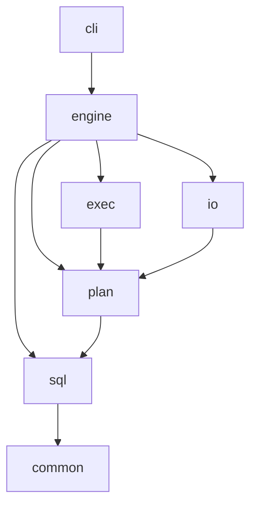

# Architecture

antb1 is a small, single-process SQL engine over Parquet files. It is split into seven C++23 static libraries
(modules) and one binary, `antb1`. This page describes the code as it is today; the engine design beyond the first
SQL slice is still open (see [ADR 0003](adr/0003-engine-architecture.md)). Joins, derived tables, common table
expressions and uncorrelated subqueries are designed in [ADR 0022](adr/0022-joins-and-query-blocks.md): the executor
runs inner, left, semi, anti, null-aware anti and one-row joins as hash joins, but no query binds to a join yet, and
the steps below change with the PRs that build the rest.

## Modules

`cmake/Antb1Modules.cmake` is the single source of truth for which module may depend on which module and which
external libraries it may link. `antb1_add_module()` fails the configure step on any other edge, and
`antb1_check_module_graph()` catches edges added around it. The table below must match that file exactly
(`pixi run lint` compares them); changing an edge is an architecture decision that needs an ADR.

| Module | May depend on | External libraries |
| --- | --- | --- |
| `common` | none | none |
| `sql` | `common` | none |
| `plan` | `common`, `sql` | Arrow |
| `io` | `common`, `plan` | Arrow, Parquet |
| `exec` | `common`, `plan` | Arrow, ArrowCompute |
| `engine` | `common`, `sql`, `plan`, `io`, `exec` | Arrow, ArrowCompute |
| `cli` | `common`, `engine` | Arrow, CLI11 |

Responsibilities:

- `common`: invariant checks (`ANTB1_CHECK`, `ANTB1_DCHECK`), checked integer narrowing (`TryNarrow`, `Narrow`),
  `SourceSpan`, the `Int128` helpers, UTF-8 validation (`Utf8SequenceLength`, shared by the lexer, the JSON output and
  the test harness) and the version string. Arrow-free.
- `sql`: lexer, hand-written recursive-descent parser, AST with source spans, canonical unparser (`ToSql`) and
  `EqualIgnoringSpans`. Arrow-free; errors are `std::expected<T, sql::ParseError>`
  ([ADR 0008](adr/0008-parser-and-unparser.md)).
- `plan`: logical types and their Arrow mapping, the `plan::Table` interface, the case-insensitive `Catalog`, the
  binder with exact literal folding (`binder.h`, `literal.h`) and its private name scopes (`src/plan/scope.h`: the
  bindings of a query block and the name rules of [ADR 0022](adr/0022-joins-and-query-blocks.md)) and join order
  (`src/plan/join_order.h`: greedy and left-deep, estimated from footer row counts, ranges and distinct-count
  hints), the logical plan (`logical_plan.h`; a `Join` has two inputs,
  every other node at most one), the rule
  optimizer (`optimizer.h`), EXPLAIN, and the error boundary between `std::expected` and `arrow::Status` in
  `src/plan/include/antb1/plan/sql_status.h` ([ADR 0005](adr/0005-error-boundary.md)).
- `io`: `io::ParquetTable`, which implements `plan::Table` over one or more Parquet files with identical schemas,
  and glob expansion. Its `Scan` reads the requested top-level fields file by file (one `parquet::arrow::FileReader`
  at a time, single-threaded, mapping each field to its Parquet leaf columns, without pre-buffering, so it holds
  about one row group of the scanned columns rather than every chunk read so far) and converts the batches to the
  engine view: UTF8 and large strings to binary without UTF-8 validation, FLOAT to DOUBLE, a USMALLINT or INTEGER
  column read as DATE to date32. Every Parquet exception and read failure becomes an `IOError` here. The footers
  read at `Open` are kept and reused by every scan; a file whose size or footer bytes changed since is an
  `IOError`. The table's parts (`plan::Table::num_parts`, `part_rows`, `ScanPart`), the units of parallel work of
  [ADR 0013](adr/0013-parallel-execution.md), are its row groups with rows in file order; scanning them one after
  another gives the rows of `Scan`. Other tables are one part by default. A part's footer statistics are the exact
  min, max and NULL count of an integer-valued column (`part_stats`, for skipping parts) and the distinct count a
  writer stored for a column (`part_distinct_count`, a hint for the join order: DuckDB stores one for each
  dictionary-encoded column chunk, parquet-cpp none). A part can also be scanned with a
  `plan::ScanFilter` (filter pushdown, [ADR 0020](adr/0020-filter-pushdown.md)): for flat integer, DATE, DOUBLE and
  VARCHAR columns (`supports_scan_filter`), `src/io/filtered_scan.cc` reads the row group through Parquet's column
  readers, applies the filter to the filter's columns as it decodes them (strings as views into the decoded pages,
  piece by piece) and copies only the rows that pass, for every column.
- `exec`: pull-based, batch-at-a-time physical operators (`TableScan`, `Filter`, `Compute`, `Project`, `ScalarAggregate`,
  `GroupAggregate`, `Sort`, `Limit`, `RowCount`; see [Execution](#execution)), the exact aggregate states (scalar
  and grouped), the row comparator and sort buffer, the join hash table (`JoinTableBuilder`, `JoinTable`) and the
  hash joins' operators (`JoinBuild`, `BuildsFirstOperator`, `HashJoinOperator`, which the physical planner plans
  every join with; see [Execution](#execution)), the physical planner and `Drain`. It scans only through
  `plan::Table` and never depends on `io`.
- `engine`: `engine::Session` (owns the catalog, calls `arrow::compute::Initialize()`, runs parse, bind, plan and
  execute) and the canonical value formatter used for every output format.
- `cli`: the CLI11 command line (`query`, `explain`, `schema`, `bench`, `version`), error reporting and exit codes;
  `bench` writes ClickBench's result JSON ([benchmarks.md](benchmarks.md)). The `antb1` executable is
  `src/cli/main.cc`.

`common` and `sql` never include Arrow, so the front end stays small, fast to build and easy to fuzz.

```mermaid
graph TD
  cli --> engine
  engine --> exec
  engine --> io
  engine --> plan
  engine --> sql
  exec --> plan
  io --> plan
  plan --> sql
  sql --> common
```

Every module except `common` may also depend on `common` directly; those edges are left out of the diagram.

## Query lifecycle

A query such as `antb1 query -c "SELECT COUNT(*) FROM t" --table "t=/data/part_*.parquet"` runs through these
steps (only step 7 uses more than one thread):

1. `cli` parses the command line, reads the SQL (`-c`, `-c -` for stdin, or `-f`) and creates an `engine::Session`,
   which calls `arrow::compute::Initialize()`.
2. `--table NAME=PATH[,PATH|GLOB]` registers an `io::ParquetTable`: globs expand to a sorted file list, every
   footer is read, schemas must match, and column overrides such as `--clickbench` (EventDate as DATE) apply. No
   data pages are read at this point.
3. Parse (`sql::Parse`): tokens, then a `SelectStatement` AST with spans; expressions are trees (`sql::Expr`), parsed
   by precedence climbing with a depth limit, and the FROM clause is a flat list of items (tables or paths, with
   their aliases and joins). Syntax outside the grammar is a `kUnsupported` error with the span of
   the offending token. The engine converts a parse error with
   `plan::ToArrowStatus` into an `arrow::Status` that carries a `SqlErrorDetail`.
4. Bind (`plan::Bind`): what the binder does not answer yet (a FROM list of several items, an alias, a qualified
   name, many expressions) is `kUnsupported` before any name resolves; then
   table names resolve case-insensitively in the catalog (or `FROM 'path'` opens a file),
   columns resolve in the block's scope (`src/plan/scope.h`: one binding per FROM item, with its columns' ids, types
   and FLOAT flags), types are checked, and every `WHERE` literal is folded exactly into
   its column's type ([Binding](sql-subset.md#binding)); `HAVING` binds the same way against the aggregation's output
   and becomes a `Filter` above it. The result is a `plan::LogicalPlan`: a tree of immutable
   nodes in a `std::variant` (`Scan`, `Filter`, `Compute`, `Project`, `Aggregate`, `GroupAggregate`, `Sort`, `Limit`,
   `RowCount`) plus the output columns. Every column gets a `plan::ColumnId` where it is created (a field, a computed
   expression, an aggregate call or key, a select item), and a column reference names the column it reads by id and
   by its position in the input ([ADR 0022](adr/0022-joins-and-query-blocks.md)).
5. Optimize (`plan::Optimize`): `COUNT(*)` without `WHERE` to `RowCount`; a `GROUP BY` key computed only from other
   (not DOUBLE) keys is dropped from the `GroupAggregate` and computed once per group above it, unless a `Limit`
   without a `Sort` reads it (ADR 0018);
   `Limit` below `Project`; and projection pruning (a `Scan` reads only the fields used above it; a `Join` asks both
   inputs for what is used above it plus its keys and residuals). Every rule visits every input of a node
   (`plan::InputsOf`, `plan::WithInputs`). The binder and
   every rule refer to columns by id only, and columns keep their ids through every rule. The last step of both
   `Bind` and `Optimize`, `plan::ResolvePositions`, sets every position from the ids; the executor reads positions
   only.
6. Physical plan (`exec::BuildPhysicalPlan`): an exhaustive `std::visit` turns each logical node into an operator
   over the operator of its input; a `Limit` over a `Sort` becomes one top-N `SortOperator` (over a partitioned
   `GROUP BY`, each partition first keeps its own top rows, ADR 0011). A global aggregation
   whose calls are all `COUNT(DISTINCT x)` of one column over a part pipeline becomes a `GroupAggregate` by `x`
   (merged in parallel, partitioned) with `COUNT(x)` over its groups. Other aggregations with `COUNT(DISTINCT)`
   over a part pipeline run in two levels when their calls allow it (`exec::TwoLevelAggregation`,
   [ADR 0014](adr/0014-two-level-aggregation.md)). The chain of `Filter`,
   `Compute` and `Project` nodes and joins' probes over a `Scan` is a part pipeline, built once per table part
   (see [Execution](#execution)). A `Join` of any kind is a hash join
   ([ADR 0022](adr/0022-joins-and-query-blocks.md)): a build of one input (keyless for a one-row join), made once per
   pipeline before the factory of its parts, and a probe of the other, in that input's part pipeline or over it; a
   malformed join (keys of two types, say) is `Invalid`.
7. Drain (`exec::Drain`): `Open`, pull batches with `Next` until the end of the stream, `Close` (also after an
   error); the selected rows of the batches form an `arrow::Table`, and the engine names its columns. The part
   pipelines run on the session's thread pool (`--threads`, `engine::SessionOptions::threads`), and so do the batches
   of a `Compute` over a whole input (`ParallelComputeOperator`).
8. Format (`engine::FormatResult`): `table`, `csv` or `json` output on stdout, built from one canonical value
   formatter. With `--timing`, the elapsed seconds are the last line on stderr.

`antb1 explain` stops after step 5 and prints the optimized logical plan. `antb1 explain --analyze` builds the physical
plan with a profile root (`exec::ProfileNode`; each operator wrapped in `exec::ProfiledOperator`, a part pipeline
profiled once per part into the same nodes), runs it, drops the rows and prints the profile
(`engine::FormatProfile`, [ADR 0015](adr/0015-query-profiles.md)). Any error travels up as an
`arrow::Status`, and `cli` maps it to an exit code (see [the SQL subset](sql-subset.md#exit-codes)).

## Execution

Operators pull `exec::Batch`es from their input: an Arrow record batch and an optional selection, a boolean array
without NULLs that marks the rows taking part. A filter never copies data. A projection turns a selection into data,
and so does a hash join's probe when it copies rows: an inner or a left join's (probe row, match) pairs of a build
whose keys repeat, the rows it evaluates residuals on, and the columns of candidate pairs that residuals read; with
unique build keys it keeps the probe batch and selects the matched rows (a left join without residuals, its selected
rows; a left join with residuals copies its rows). A semi, anti or null-aware anti join only selects rows, and a
one-row join appends its build's values to the probe batch.
Every operator instance is used by one thread.

**Parts** ([ADR 0013](adr/0013-parallel-execution.md)). A table is split into parts (`plan::Table::num_parts`,
`ScanPart`): the row groups of a Parquet table. The pipeline below the first blocking operator, a chain of `Filter`,
`Compute`, `Project` and joins' probes over a `Scan` (a probe's input is the side it does not build on), is
built once per part with a `TableScanOperator` of that part, so parts share no operator state; the probes of every
part read the same builds, made once with the pipeline. `exec::PartScheduler` runs the parts on
`ExecContext::executor` (an Arrow `ThreadPool` the `Session` owns when it has more than one thread) and hands their
results back strictly in part order. At most
2 × threads parts are running or finished but not yet taken. With one thread, each part runs on the calling thread
when it is reached: the same code, so a result does not depend on the thread count. The first failing part in part
order decides the error. Parts after the point where the consumer stops (a met `LIMIT`) are never started or are
stopped at their next batch, and their errors are dropped.

**Skipping parts.** The physical planner reads only the parts a pipeline's WHERE can match: for each part it asks
`plan::Table::part_stats` (for Parquet, the row group's column chunk statistics from the footer: exact min, max and
NULL count of integer-valued columns, including a DATE read from day numbers, but not HUGEINT, whose decimal
statistics some writers got wrong) and drops the part when a predicate of
a `Filter` directly on the scan is false for every row there (`exec::KeptParts`, `src/exec/part_pruning.h`):
`= < <= > >=` against the min/max, `<>` when every value is the constant, `IN` with every value outside, any
comparison, `IN` or `IS NOT NULL` on an all-NULL column, and a folded `FALSE`. Unknown statistics (DOUBLE, whose
min/max may leave NaN out; VARCHAR, whose min/max may be truncated; TIMESTAMP; a file without statistics) never
skip, so a skipped part never holds a matching row and results do not change.

**Filtering while scanning.** Within the parts it reads, the scan applies the predicates of that `Filter` that read
one column against literals (`<op>`, `[NOT] IN`, `[NOT] LIKE`, `IS NOT NULL`; `exec::PushableToScan`), when the
table supports it for the scanned columns (`plan::Table::supports_scan_filter`): the `TableScanOperator` builds an
`exec::MakeScanFilter` (`src/exec/include/antb1/exec/scan_filter.h`) and the table returns only the rows that pass ([ADR
0020](adr/0020-filter-pushdown.md)). Fixed-width columns are evaluated with the `Filter`'s own `PredicateEvaluator`,
VARCHAR columns on views into the decoded pages, with the same results. The `Filter` keeps the other predicates
(comparisons of two columns, computed conditions); with a folded `FALSE`, which reads nothing, it keeps them all.
The narrow scans of late materialization are filtered too, on their early columns: the table reports each passing
row's position in the part (`ScanPart` with `positions`), and the row ids are made from those.

**Memory.** The `Session` owns an `exec::MemoryBudget` (`--memory-limit`, `engine::SessionOptions::memory_limit`):
an Arrow memory pool that is `ExecContext::pool` for every query, and that the Parquet reader decodes into
(`plan::Table::Scan` and `ScanPart` take the pool). It counts every buffer and, through `Reserve`, the containers
operators keep outside Arrow buffers: the grouped aggregate states (`GroupedAggregateState::memory_usage`), the
sort buffer's row references (`SortBuffer::memory_usage`, plus `sort_memory` while it sorts), a join build's
containers (each part's row hashes, the partitions' runs of rows, the table's row references, offsets and bucket
directories, and the temporaries of `Finish`) and a probe's (the matches of its batch, the rows of its output),
each held in an `exec::MemoryReservation` that gives the bytes back on `Close` (a join table's when the table is
destroyed). A finished build stays held until the parts of its probe pipeline are done, and counts toward the
pressure below; the builds a build's input probes go once that build is finished. The count is atomic and checked
before an allocation, so threads never pass the limit together; past it, an allocation fails with
`Status::OutOfMemory` and nothing is left behind. A result keeps the budget alive (`QueryResult::memory`) as long as
its buffers exist. The
part scheduler's window adapts to the budget: every part taken above half of the limit halves it, every part taken
below widens it by one, and above half no new part starts while another is in flight. A part that runs out of memory
next to others does not fail the query: the parts ahead are dropped (and run again when reached) and it runs again
alone. The partition lanes of a GROUP BY hold at most as many parts as the window (one above half of the limit)
before the consumer waits for them to merge, and they finish merging before a part runs again alone. A
`std::bad_alloc` from a container (outside the budget's view) is caught in the part tasks, in `exec::ForEach` (in
its tasks and around each `Submit`), in `PartitionLanes::Add` (queuing a part, starting a lane's task), around the
part scheduler's `Submit`, in `Drain`, in every call of the join hash table and in a join build's `Prepare`, and
becomes `OutOfMemory` too. Three places in Arrow still end the process on one: its thread pool's `Spawn`, where an
OpenTelemetry call allocates in a `noexcept` function, a compute function's call, which allocates its tracing span
where an exception cannot pass, and the making of an `arrow::Result` from a `Status`, whose `noexcept` constructor
copies it.

The budget's pool is Arrow's default pool, mimalloc. On Linux the `antb1` executable restarts itself once with
`MIMALLOC_PURGE_DELAY=-1` (`cli::RestartForAllocator`, ADR 0017), so that mimalloc keeps the memory a query frees
instead of returning it to the system and faulting it back in: unless the variable is set (a value the user set
wins) or `ARROW_DEFAULT_MEMORY_POOL` names another pool. The process then keeps its peak resident memory until it
exits; the budget, which counts allocations, is unchanged.

**Join builds** ([ADR 0022](adr/0022-joins-and-query-blocks.md)). An
`exec::JoinBuildPart` takes one part of a build input on any thread: it keeps the selected rows whose keys are not
NULL, splits them into 64 partitions by `exec::KeyHashes` modulo 64 (the GROUP BY rule) with one Take per column,
and keeps each row's hash. An `exec::JoinTableBuilder` takes the parts on the consumer thread in any order and hands
them to `exec::PartitionLanes` in part order, so every partition lists its rows in (part, row) order; `Finish`
builds the partitions in parallel (one at a time under memory pressure) into an immutable `exec::JoinTable`. One
SMALLINT, INTEGER, BIGINT, USMALLINT, DATE or TIMESTAMP key whose values span fewer than 8 times the rows gets the
direct layout, an offsets array indexed by the key minus the smallest key; every other key the hashed layout: per
partition, `bit_ceil(rows)` buckets on the hash bits above the partition's, each listing its distinct keys with
their hash and range of rows. The rows stay in the parts' taken batches (`JoinTable::chunks`, referenced as
`JoinRowRef{chunk, row}`, at most 2^32 - 1 rows), each key's rows together and in (part, row) order. The table
keeps whether any key repeats (`unique`), whether the input had a NULL key (`has_null`) and whether it was empty. A
keyless build (`JoinBuildSpec::Keyless`, a one-row join's) holds every row as the rows of one key, and has nothing to
probe.
`JoinTable::Find` gives every probe row the range of its matches, from any number of threads at once and without a
lock; neither the thread count nor the order in which parts arrive changes the table, nor the failure of a build that
fails: the failure of its earliest part, as in the serial order (a merge's before a later part's failed release).
The hash joins' operators (`src/exec/hash_join.h`) use it. An `exec::JoinBuild` builds a table for a join of its
kind from a part pipeline (its parts on the pool through the part scheduler) or from any operator drained on the
consumer thread, after the builds its own input probes (post-order); a one-row join's build must hold one row, whose
values it then makes once as columns of up to `batch_size` rows (fewer for long VARCHAR values) that every probe
slices. An `exec::BuildsFirstOperator` prepares a probe pipeline's builds when it is first pulled, then opens the
pipeline's sink, and releases them once the sink's parts are done (`exec::PartSink`'s callback). An
`exec::HashJoinOperator` probes, by its build's kind: an inner join with a build of unique keys keeps the probe
batch's columns and selects the matched rows, otherwise it takes a (probe row, match) pair per output row, and its
residuals are evaluated in order, each on the rows the ones before it kept; a left join takes its pairs the same way,
with NULLs for a row without a match (on its 1:1 path it keeps the probe's selection), and evaluates its residuals on
candidate pairs, as a semi or anti join does; a semi, anti or null-aware anti join passes on
slices of the probe batch with the rows it keeps selected; a one-row join appends the slices of its build's values.
The residuals of a semi, anti or left join are evaluated (`exec::EvaluateExpr`) on the candidate pairs (a probe row
and a build row of its key), in batches of at most `batch_size` pairs with only the columns they read, in order, every
pair evaluated: semi and anti evaluate a probe batch's pairs before its windows, a left join each batch of pairs before
it emits the passing ones and, after a row's last candidate, the row padded when none passed.

The physical planner plans every join so. It walks a part pipeline with one helper (`PipelineInput`: through `Filter`,
`Compute`, `Project` and a join's probe input) to find its scan, the predicates its statistics and its scan use (only a
`Filter` right on the scan: one above a join reads the join's columns) and its joins; each join's build is made then,
once, outermost join first, before the factory of the pipeline's parts, so no part number of the probe side reaches a
build input, whose part pipeline has its own parts, pruning and pushdown. A build input that is no part pipeline is
drained. The sink of a pipeline with joins runs behind a `BuildsFirstOperator`; a probe over a serial input prepares its
own build at its first `Next`. Late materialization declines over a join; the `COUNT(DISTINCT)` rewrite, the partition
top-N and a `LIMIT` over a pipeline apply over one, its builds first. An inner or a semi join's build whose table holds
no row empties its join (`exec::EmptiesJoin`): the probe never opens its input, and the builds below it are not
prepared. An anti, null-aware anti or left join reads its probe input whatever its build holds (over a build input with
a NULL key, the null-aware one keeps no row but reads them all, as DuckDB does). Errors follow the serial order: the
builds, outermost first and each after the builds its input probes, then the probe's parts.

| Operator | Logical node | Does |
| --- | --- | --- |
| `TableScanOperator` | `Scan` | `plan::Table::ScanPart` (in a part pipeline) or `Scan` of the referenced fields only, in batches of `ExecContext::batch_size` rows (64Ki) |
| `PartUnionOperator` | the top of a part pipeline | the batches of every part in part order, parts computed ahead on the pool; under a `Limit`, each part stops after `limit + offset` selected rows |
| `PartAggregateOperator` | `Aggregate` over a part pipeline | aggregates every part into its own `AggregateState`s on the pool, then merges them in part order and emits one row |
| `PartGroupAggregateOperator` | `GroupAggregate` over a part pipeline | groups every part into its own `exec::GroupTable` on the pool and splits its groups into 64 partitions by a hash of their normalized keys (`GroupTable::Partition`, on the worker); merges the parts in part order into one table per partition (a part whose first 65536 rows (a batch, or more under a filter) make more groups than 1/4 of them stops aggregating on its own: its other rows are split by the same key hash, `GroupTable::RouteRows`, and the partitions aggregate them after the part's groups), each partition in its own lane on the pool (`exec::PartitionLanes`: a lane merges the parts in the order they come and never waits for another lane; the partition's unique keys through the partition table's grouper give the groups they become; `GroupedAggregateState::MergeGroups(part_state, from, to)` folds just the partition's groups, in time proportional to them; a new group keeps the part's first-seen keys); then builds the partitions' rows in parallel, as many partitions at a time as threads (one under memory pressure), and emits them partition after partition as `GroupAggregate` does; under a top-N (`Limit` over `Sort` right above it) each partition keeps only its first `limit + offset` rows in the top-N's order as it builds them (`PartitionTopN`, ADR 0011) |
| `PartTwoLevelAggregateOperator` | `GroupAggregate` or `Aggregate` with `COUNT(DISTINCT)` over a part pipeline, when `TwoLevelAggregation` allows it | groups every part into one inner `GroupTable` per distinct column (keys K and the column) and a plain one by K for the other calls; the first parts (4M rows by metadata) decide the heavy K (`HeavyHitters`); partitions a light K by the hash of K and a heavy K's groups by the hash of K and the column (`GroupTable::Partition(prefix, heavy)`); merges as `PartGroupAggregateOperator`; then, per partition in parallel, groups the inner groups by K (`OuterGroups`: a distinct column's count is its inner groups with a non-NULL value) and builds the light groups' rows; merges the heavy K's groups across partitions in partition order and emits them last ([ADR 0014](adr/0014-two-level-aggregation.md)) |
| `PartTopNOperator` | `Limit` over `Sort` (a top-N) over a part pipeline | keeps every part's first `limit + offset` rows of the order in its own `SortBuffer` on the pool, merges the buffers in part order (ties keep their input order, parts in part order) and keeps the first `limit + offset` again: exactly the serial top-N's rows and order; emits the window; with late materialization ([ADR 0016](adr/0016-late-materialization.md): limit + offset at most half of the kept parts) the parts scan only the columns their filters, computations and keys read (`exec::LateScan`: the others are NULL placeholders, one of them carries the rows' ids), and the window's other columns are read from their parts afterwards, one task per part and column |
| `FilterOperator` | `Filter` | evaluates every comparison with Arrow's comparison kernels (`equal`, `less`, ...) and `[NOT] LIKE` with `exec::LikePattern` (DuckDB's rules; patterns without `_` match by their literal segments), `[NOT] IN` as `equal` per value combined with `or_kleene` (and `invert` for NOT IN), compares two columns with the same kernels in their common type (a DECIMAL against a DECIMAL of another scale or an integer exactly by value, `exec::CompareExact`, and against a DOUBLE after DuckDB's conversion, `exec::DecimalToDouble`, which also converts a DECIMAL column compared with DOUBLE constants), combines them with `and_kleene`, keeps the rows of a computed BOOLEAN condition (`IS TRUE`, for `OR` and `NOT`), turns NULL into false and attaches the result as the selection (one `exec::PredicateEvaluator` per predicate, shared with `Compute`); skips batches without a selected row; a folded `FALSE` ends the stream without reading |
| `ComputeOperator` | `Compute` | materializes the selected rows and appends one array per expression (`exec::EvaluateExpr`): Arrow's checked kernels for integer `+ - *` and negation in the result type (an overflow is an execution error), `divide` in DOUBLE, own loops for `//`, `%` and HUGEINT arithmetic, `binary_length` for `strlen`, `replace_substring_regex` (RE2) for `regexp_replace`, a checked loop for `epoch_ms` (`toDateTime`), own 64-bit civil-calendar loops for `EXTRACT` and `date_trunc` (DuckDB's whole TIMESTAMP range; infinities kept or NULL), the filter's predicate evaluation for comparisons inside conditions, `and_kleene`/`or_kleene`/`invert` for `AND`/`OR`/`NOT`, and `CASE` branch by branch, each condition and value computed only for its rows (`Filter`, then `replace_with_mask`), a value cast to a DECIMAL result as DuckDB casts it (`CastToDecimal` in `src/exec/decimal.h`), and a join key's cast (`plan::CastExpr`, an exact widening; any other cast is `Invalid`) through Arrow's safe cast or `CastToDecimal` ([ADR 0012](adr/0012-scalar-expressions.md), [ADR 0021](adr/0021-decimal-semantics.md), [ADR 0022](adr/0022-joins-and-query-blocks.md)) |
| `ParallelComputeOperator` | `Compute` outside a part pipeline (over an aggregation or a sort) | as `ComputeOperator`, with the executor: reads its input ahead on the consumer's thread and computes several batches at a time, returning them strictly in input order, so its output and its first error in batch order are `ComputeOperator`'s; a batch read ahead but never returned never reports its error. Memory as the part scheduler: a window of `threads` batches, halved by every batch taken under pressure and widened by one otherwise; a batch out of memory on a worker is computed again alone on the consumer's thread (the others in flight dropped and computed again when reached), and only that failure fails the query; results are released on the consumer's thread |
| `ProjectOperator` | `Project` | selects columns and materializes the selected rows with Arrow's `Filter` kernel; a constant item becomes an array of its value per batch (`MakeArrayFromScalar`) |
| `ScalarAggregateOperator` | `Aggregate` over other input | feeds every batch and its selection to one `AggregateState` per call, then emits one row |
| `GroupAggregateOperator` | `GroupAggregate` over other input | through an `exec::GroupTable`, materializes the selected rows, maps their keys to group ids with Arrow's `Grouper` (DOUBLE keys normalized first), feeds one `GroupedAggregateState` per call; after the input, emits one row per group: the keys as first seen, then the aggregates; without keys (`GROUP BY` of constants only) every row is in one group |
| `SortOperator` | `Sort`, or `Limit` over `Sort` over other input | reads its whole input into a `SortBuffer`, sorts row references stably with `RowComparator` (DuckDB's order: NULLs last by default, NaN above every number, VARCHAR by bytes; each row carries an order-preserving 64-bit prefix of its first key, so most comparisons are integer compares) and emits the rows in batches, gathered column by column with typed builders; with a limit it keeps only `limit + offset` rows while it reads (top-N) and emits the window ([ADR 0011](adr/0011-sorting-and-top-n.md)) |
| `LimitOperator` | `Limit` | skips `offset` rows, passes on at most `limit` rows (narrowing selections, not copying) and then never pulls its input again |
| `HashJoinOperator` | a `Join`: its probe, in the part pipeline of the input it does not build on, or over that input | for every probe batch, `JoinTable::Find` of its selected rows' keys; an inner join with a build of unique keys, windows of `batch_size` rows of the probe batch (slices, not copies) selected where they matched, the build's columns gathered by match and NULL elsewhere (`exec::GatherRows`); otherwise a batch of up to `batch_size` (probe row, match) pairs, the probe's columns taken and the build's gathered; then the residuals in order, each on the rows the ones before kept (NULL is false); rows in probe order, each one's matches in the build's (part, row) order; a left join the same, with a row without a match padded with NULLs of the build's types, and the probe's selection kept on the 1:1 path; a semi, anti or null-aware anti join, windows of `batch_size` rows of the probe batch selected where it keeps a row, without a lookup when it keeps every row or none; the residuals of a semi, anti or left join on the candidate pairs, every pair evaluated, a left join padding a row none of whose candidates passed after its last candidate; a one-row join, windows of the probe batch with its build's values sliced; over a serial input it prepares its own `JoinBuild` at its first `Next`; when its build empties the join it never opens its input |
| `BuildsFirstOperator` | the sink of a part pipeline whose probes read builds | prepares the pipeline's builds (`exec::JoinBuild`: the `JoinTable` of a build input's parts, or of a drained operator's batches) at its first `Next`, outermost first and stopping after one that empties its join, then opens the sink and returns its batches; releases the builds once the sink's parts are done, or at `Close` |
| `RowCountOperator` | `RowCount` | one BIGINT row from the table's exact row count |

The aggregate states (`src/exec/include/antb1/exec/aggregate_state.h`) implement `Consume(values, selection)`,
`Merge` and `Finalize`. `COUNT(*)` is the true count of the selection; `COUNT(col)`, `SUM` and `AVG` walk the runs
of rows that are both selected and non-NULL (one bitmap AND); integer `SUM` and `AVG` accumulate in `antb1::Int128`
and `SUM` returns decimal128(38, 0), so nothing wraps at 64 bits; `MIN` and `MAX` run Arrow's `min_max` on the
filtered values of each batch and keep the best; `COUNT(DISTINCT col)` keeps the distinct values as the keys of an
Arrow `Grouper` (DOUBLE values normalized like `GROUP BY` keys) and counts them without NULL. The grouped states
(`src/exec/include/antb1/exec/grouped_aggregate_state.h`) keep the same accumulators per group, fed rows with a group
id each (`COUNT(DISTINCT col)`: a `Grouper` over the distinct (group, value) pairs); their `Merge` folds another
state's groups through a group map, so partial results of separate parts of the input can be combined
([ADR 0010](adr/0010-grouped-aggregation.md)). Semantics:
[sql-subset.md](sql-subset.md#semantics).

## Where to add things

| To add | Change | Also update |
| --- | --- | --- |
| SQL syntax | `src/sql/` (lexer, parser, AST, unparser) with tests in `src/sql/tests/` | [sql-subset.md](sql-subset.md) grammar |
| Name resolution or type rules | `src/plan/binder.cc`, `src/plan/scope.cc`, `src/plan/types.cc` | [sql-subset.md](sql-subset.md), [ADR 0004](adr/0004-types-null-overflow-semantics.md) if semantics change |
| A logical plan node | the variant in `src/plan/include/antb1/plan/logical_plan.h`; the compiler then points at every `std::visit` to extend (`InputsOf`, `WithInputs`, `OutputIds` and the position resolver, the physical planner, the optimizer, EXPLAIN) | tests in `src/plan/tests/` and `src/exec/tests/` |
| An optimizer rule | `src/plan/optimizer.cc` | tests in `src/plan/tests/optimizer_test.cc`, an EXPLAIN golden in `tests/cli/` |
| A physical operator | `src/exec/`; its name in the physical planner (`Builder::Name`), and metrics for its phases through `profile()` and `ProfileTimer` | tests in `src/exec/tests/` |
| A SQL feature antb1 now answers | the modules above | `.slt` records in `tests/slt/cases/` (`pixi run slt-complete`), the feature in `tests/slt/supported_features.h`, [sql-subset.md](sql-subset.md); when `pixi run test-data` reports a new ClickBench pass, the ratchet `tests/data/clickbench_status.json` and the status table; when a query derived from TPC-H starts to pass, `tests/data/tpch_status.json` and its table |
| A table source or file format | a new `plan::Table` implementation in `src/io/` | an ADR if it needs a new dependency |
| A CLI flag or subcommand | `src/cli/cli.cc` | tests in `src/cli/tests/`, CLI goldens in `tests/cli/`, [sql-subset.md](sql-subset.md) |
| An output format | `src/engine/format.cc` | tests in `src/engine/tests/` |
| A micro benchmark | `bench/micro_bench.cc` | [benchmarks.md](benchmarks.md) |
| A module edge or external library | `cmake/Antb1Modules.cmake` (ask a maintainer first) | this page and a new ADR |
| A cross-module test suite | `tests/CMakeLists.txt` | [testing.md](testing.md) |
| A pixi task | `pixi.toml`, in exactly one environment (ask a maintainer first) | the command table in [AGENTS.md](../AGENTS.md) or [ci.md](ci.md) |
